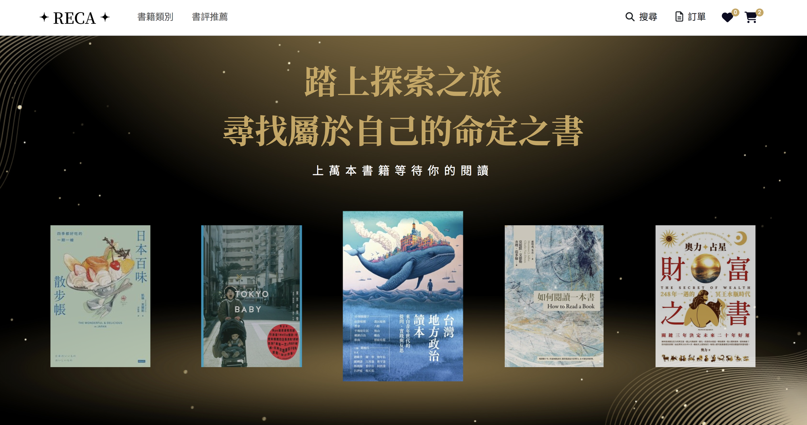

# Reca 書店

以書店做為主題的電商網站，主要以 Vue3 撰寫，有分為前台、後台。

[Demo 網址](https://snershen.github.io/RECA-Bookstore/#/user/home)

## 技術與套件

- Vue3: 以 Option API 形式轉寫
- Vite
- Vue Router
- Vue-loading-overlay: 頁面載入效果
- VeeValidate: 驗證表單內容
- Pinia: 管理元件狀態
- Axios: 串接與管理 API
- Bootstrap 5: UI 框架
- SweetAlert2
- Swiper: 輪播套件
- Font Awesome: 網頁 icon

## 網站功能

### 前台

- 購物車、結帳功能
- 收藏書籍：透過 localStorage 儲存使用者喜愛書籍清單
- 全站搜尋書籍
- 書籍分類

### 後台

可針對產品、訂單、優惠券、文章等內容進行編輯，包括新增、編輯、修改、移除等功能

## 說明

此網站僅做個人練習使用，不涉及任何商業用途，書本介紹與圖片皆擷取自 Readmoo 電子書城
